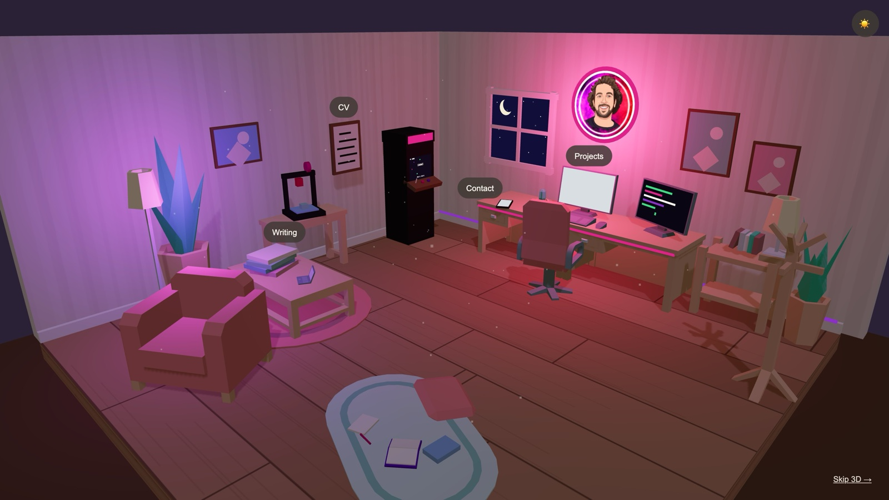

# somosbytes

Diego Acero's portfolio, built as a room you look around instead of a page you scroll. The
projects sit on the PC, the writing on the magazine stack, the CV in the wall frame, the
contact details on the phone — click one and the camera flies to it. It is a static site:
no backend, no tracking, and nothing fetched at runtime from anywhere but its own origin.



## The room

Five things are clickable. Four of them say so:

| Hotspot | What it opens |
| --- | --- |
| PC | The projects, rendered as a little desktop OS on the monitor |
| Magazine stack | The Substack |
| Wall frame | The CV (PDF) |
| Phone | GitHub and LinkedIn |

The fifth carries no label, no hover glow and no pulse. It is playable, and finding it is the
point — `openspec/specs/arcade-minigame/spec.md` spoils it if you would rather just read.

Navigation is a three-state machine in `src/state/store.ts`: `overview` → `focused` →
`screen`, where `screen` is reached only by the hotspots that have an interactive surface.
Escape, the back button and a click on empty space all return to overview, and none of them
fire mid-flight, so a stray click never cancels a zoom. A sun/moon toggle in the corner
switches the room between `day` and `dusk` moods (dusk is the default), remembered in
`localStorage`.

## When 3D isn't an option

The same content exists as a plain HTML page, and it is always in the DOM — visible when the
3D view is off, visually hidden for crawlers and screen readers when it is on. It takes over
when WebGL is missing, when the visitor clicks *Skip 3D* (remembered across visits), when the
URL carries `?no3d`, or when the WebGL context is lost mid-session, in which case a banner
explains the switch and offers a reload.

three.js lives in a lazy chunk, so visitors who never see the room never download it. The
canvas renders on demand rather than every frame, one directional light casts shadows on top
of pre-rendered contact shadows, and ambient motion stops when the tab is hidden or when
`prefers-reduced-motion` is set.

## Stack

React 19, TypeScript, Vite 8, three.js via react-three-fiber and drei, zustand for scene
state, oxlint for linting. No CSS framework and no UI kit.

## Getting started

Node 26, pinned in `.nvmrc` (Vite 8 and TypeScript 6 set the floor at 22).

```bash
npm install
npm run dev      # http://localhost:5173
npm run build    # type-check + static bundle into dist/
npm run preview  # serve the built bundle
npm run lint
```

`dist/` is fully static and needs nothing more than a file server.

## Editing the content

Everything a visitor reads comes from `src/content/portfolio.ts`, typed by
`src/content/types.ts`. Add a project there and it appears both on the 3D monitor and in the
HTML fallback — neither the scene nor the UI needs touching. Icons go in `public/icons/`, the
CV in `public/cv/`, and a missing required field fails the build rather than shipping a broken
link.

## Layout

```
src/
  App.tsx            gate: WebGL check, skip preference, context-loss recovery
  Scene3DApp.tsx     the lazy three.js chunk (canvas + overlay + loader)
  content/           portfolio data and its types — the single source of truth
  fallback/          the no-3D HTML page
  scene/
    Experience.tsx   room assembly
    CameraRig.tsx    fly-to transitions and clamped orbit
    hotspots/        hotspot definitions, camera poses, labels
    objects/         desk, PC, arcade cabinet, frame, phone, decor
    screen/          the DOM "OS" rendered onto the monitor plane
  state/store.ts     mode / hotspot / mood machine
  ui/                overlay chrome and loader
public/              CC0 models, icons, CV, branding
openspec/            specs for current behaviour, proposals for what's next
```

Camera poses are data, not magic numbers: orbit to a shot in dev, press `p`, and paste the
logged pose into `src/scene/hotspots/hotspots.ts`.

## Specs

This repo is spec-driven. `openspec/specs/` describes how each capability behaves today,
`openspec/changes/` holds proposals still in flight, and `openspec/changes/archive/` keeps the
ones that landed. Behaviour changes start with a proposal there, not with code.

## Credits

The furniture is Kenney's CC0 Furniture Kit, the icons were drawn for this project, and the
logo is the author's own artwork. Full details in [CREDITS.md](CREDITS.md).

## License

The code is MIT — see [LICENSE](LICENSE). The bundled assets keep their own terms: the
furniture models are CC0, and the logo in `public/branding/` is the author's artwork and is
not covered by the MIT grant. See [CREDITS.md](CREDITS.md).
